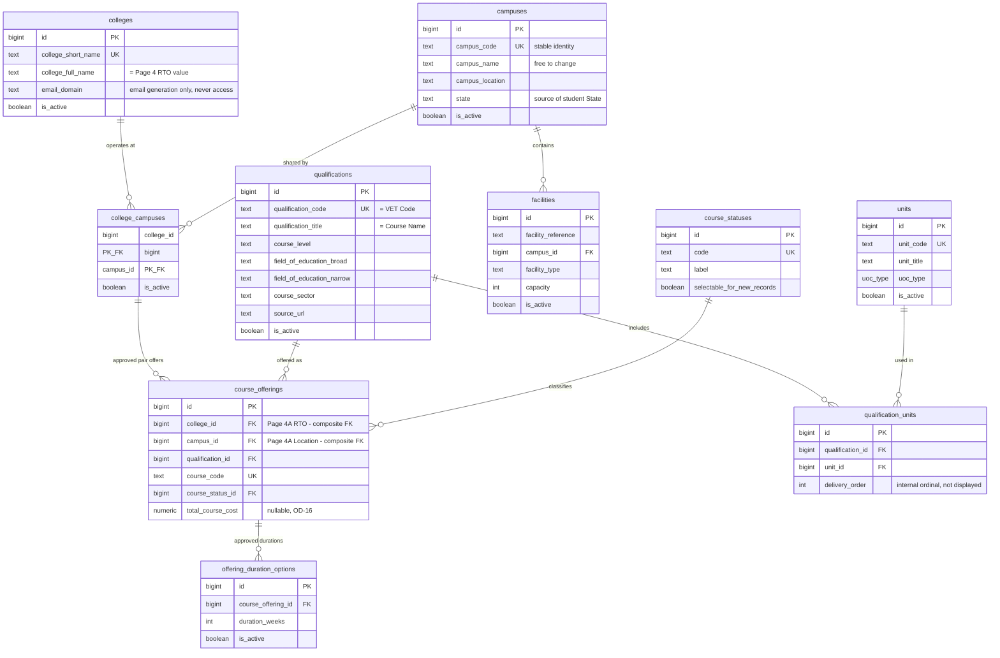
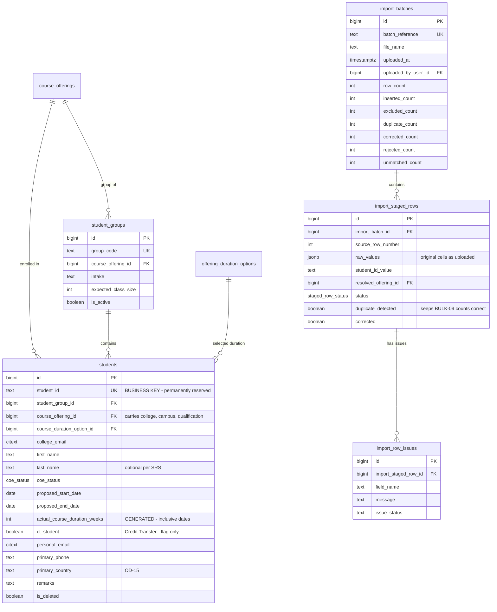
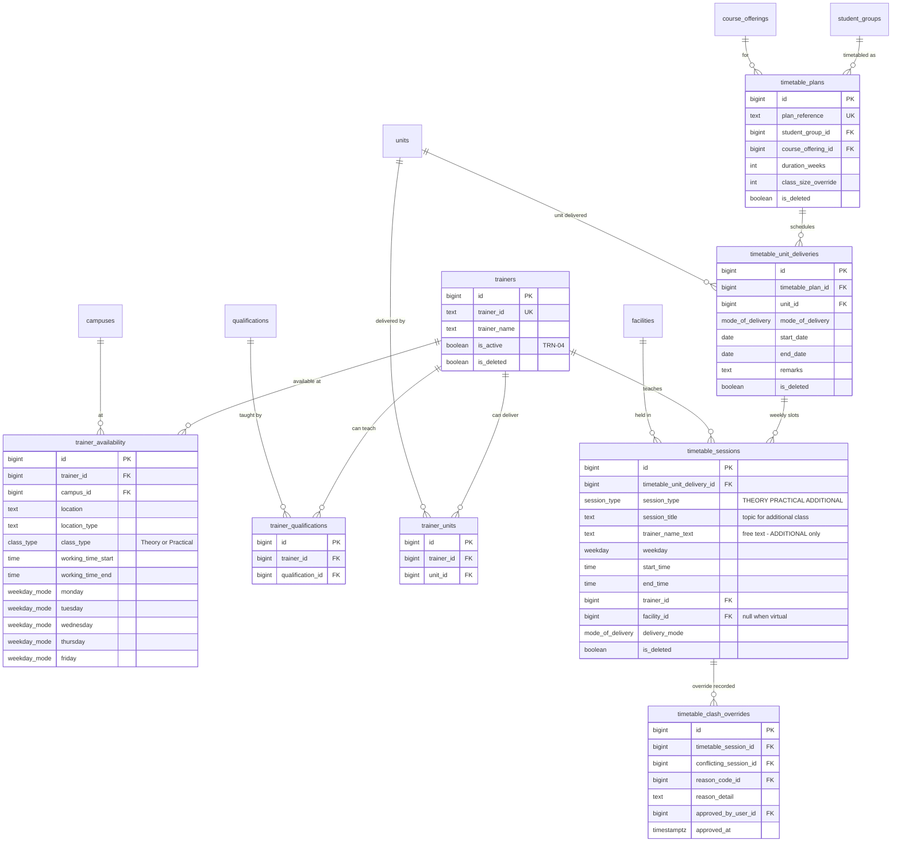

# TDMS Schema v1 — proposed ERD

**APPROVED — Schema v1, 10 August 2026, Project Owner.** Documentation only — no DDL is generated from this file.

Mermaid cannot style entities conditionally, so **entities that depend on an unresolved decision are
listed beneath the diagram** rather than shown differently inside it.

---

## 1. Identity, access and audit

```mermaid
erDiagram
    users ||--o{ user_activity_records : "acted (nullable)"
    users ||--o{ import_batches : uploaded
    reason_codes ||--o{ user_activity_records : "reason for"
    reason_codes ||--o{ reason_code_contexts : "applies in"

    users {
        bigint id PK
        uuid entra_object_id UK "nullable until first sign-in"
        citext organisation_email UK
        text display_name
        access_level access_level "3 values only"
        data_editor_assignment data_editor_assignment "null unless Data Editor"
        account_status account_status
        timestamptz last_sign_in_at
    }
    user_activity_records {
        bigint id PK
        timestamptz occurred_at
        bigint user_id FK "null = Unmatched user"
        text user_reference_snapshot
        access_level access_level_snapshot "level AT TIME OF ACTION"
        data_editor_assignment assignment_snapshot
        text page_or_function
        activity_action action
        text record_reference
        bigint reason_code_id FK
        text reason_detail
        activity_result result
        ms_sign_in_result microsoft_sign_in_result
        access_decision tdms_access_decision
        text technical_reference
        text plain_language_detail
    }
    reason_codes {
        bigint id PK
        text code UK
        text label
        boolean requires_detail
        boolean is_active
    }
    reason_code_contexts {
        bigint reason_code_id PK_FK
        text context PK
    }
```

## 2. Reference data



## 3. Students and bulk import



## 4. Trainers, facilities and timetables



---

## 5. Entities that depend on an unresolved decision

Mermaid shows these as ordinary entities above. Their real status is:

| Entity / column | Depends on | If the decision goes the other way |
| --- | --- | --- |
| `offering_duration_options` | **DBQ-03** | Replaced by a single `course_offerings.duration_weeks` column |
| `qualification_units.delivery_order` | **DBQ-05** | Removed — but then TT-08 cannot be implemented |
| `student_groups` | **DBQ-10** | Replaced by a `group_code text` column on `students` and `timetable_plans` |
| `trainer_availability` (row per weekday) | **DBQ-11** | Replaced by `monday`…`friday` columns on one availability row |
| `timetable_plans` / `_unit_deliveries` / `_sessions` split | **DBQ-12** | Collapses to one wide table mirroring the current frontend shape |
| `timetable_sessions.session_title`, `trainer_name_text`, facility CHECK | **DBQ-14** | Removed if MSCRIS uses approved trainer data and needs no topic name |
| `students.primary_country` | **OD-15** | Becomes an FK to a controlled country list |
| `course_offerings.total_course_cost` | **OD-16** | Dropped |
| `academic_calendar_breaks` *(not drawn)* | **OD-07** | Added only when break rules are approved |

### Settled by Group 1 — no longer conditional

| Item | Decision |
| --- | --- |
| `college_campuses` junction | **DBQ-04: added.** A campus can be operated by more than one college |
| `rtos` table | **DBQ-06: not built** — and SRS §1.4 now defines RTO as the College value |
| `offering_duration_options` | **DBQ-03: added.** An offering carries several approved durations |
| `students.ct_student` boolean | **DBQ-01: confirmed.** No CT unit tables |
| `students.actual_course_duration_weeks` GENERATED | **DBQ-01: confirmed.** Inclusive dates |
| `user_sessions` | **DBQ-02: not built.** Sessions are token-based |

## 6. Reading the diagram

- `PK` primary key · `FK` foreign key · `UK` unique
- All primary keys are `bigint GENERATED ALWAYS AS IDENTITY`; business codes are separate `UNIQUE`
  columns (proposal §18).
- Soft-delete column groups are abbreviated to `is_deleted` in the diagram; the full six-column group
  is in the data dictionary.
- `created_at` / `updated_at` are omitted from the diagram for readability; the policy is in
  proposal §24.
